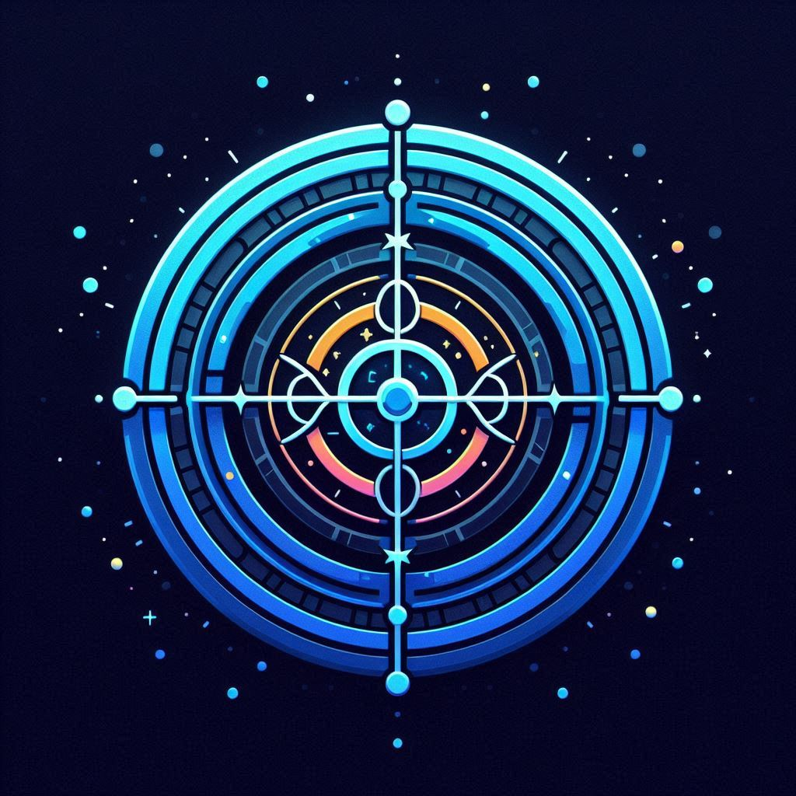

# CosmoChron

CosmoChron is an AI-powered celestial-themed Focus Timer that helps users manage their time effectively through immersive space backgrounds, achievement systems, productivity tracking, and interactive features.

<p align="center">
  
</p>

## 🚀 Features

* **Interactive Space Timer**: Customizable timer with immersive space-themed backgrounds
* **Planetary Visualization**: Explore the solar system while maintaining focus
* **Achievement System**: Unlock achievements and track progress through consistent sessions
* **Advanced Analytics Dashboard**: Visualize your productivity patterns with interactive charts
* **Breathing Guidance**: Follow subtle animations to maintain calm and focus
* **Celestial Events**: Experience special cosmic events during focus sessions
* **Focus Galaxy**: Watch your personal focus universe expand with each session
* **Virtual Space Station**: Build and customize your space station as you progress
* **Mission System**: Complete challenges to earn cosmic rewards
* **Weather Integration**: Enjoy dynamic backgrounds that change with local weather
* **Voice Commands**: Control your timer hands-free
* **Space Facts**: Learn about astronomy during breaks
* **Collaborative Focus**: Connect with friends for shared productivity sessions

## 📋 Table of Contents

* [Installation](#installation)
* [Usage](#usage)
* [Development Process](#development-process)
* [Technologies](#technologies)
* [Project Structure](#project-structure)
* [Research Findings](#research-findings)
* [Future Enhancements](#future-enhancements)
* [About CosmoChron](#about-cosmochron)
* [License](#license)
* [Acknowledgements](#acknowledgements)

## 🔧 Installation

### Prerequisites
* Node.js (v16.0.0 or higher)
* npm (v8.0.0 or higher)

### Setup Instructions
Clone the repository:

```sh
git clone https://github.com/yourusername/CosmoChron.git
cd CosmoChron
```

Install dependencies:

```
npm install
```

Start the development server:

```
npm run dev
```

Open your browser and navigate to:

```
http://localhost:3000
```

## 📱 Usage

### Timer Functionality
1. **Set Timer**: Configure your preferred focus duration (default: 25 minutes)
2. **Start Focus Session**: Click the "Start" button to begin counting down
3. **Pause/Continue**: Control your session with pause and continue buttons
4. **Reset**: Start fresh with a new timer session
5. **Complete Session**: Receive visual notification when your session completes

### Breathing Guidance
1. **Toggle Feature**: Enable/disable breathing guidance in settings
2. **Follow Animation**: Sync your breathing with the expanding and contracting animation
3. **Audio Cues**: Optionally enable subtle audio prompts

### Analytics Dashboard
1. **View Metrics**: See your focus time, completion rate, and current streak
2. **Explore Patterns**: Analyze your productivity by day and time
3. **Session History**: Review your recent focus sessions
4. **Filter Data**: View analytics for the past week, month, or year
5. **Productivity Score**: Track your overall productivity with our scoring system
6. **Export Reports**: Download your analytics data in PDF or CSV format

### Missions (achievements)
1. **Unlock Milestones**: Complete sessions to unlock various achievements
2. **Track Progress**: View your achievement collection and completion status
3. **Discover Secrets**: Find hidden achievements through special interactions

### Settings
1. **Sound Preferences**: Toggle completion sounds on/off
2. **Auto-Start**: Configure automatic session starts
3. **Notification Settings**: Customize how you receive alerts
4. **Theme Selection**: Choose your preferred space visualization

## 🛠️ Development Process

This project was developed over a multi-week process following these phases:

### Week 1: Basic Timer Display
* Created functional timer component
* Implemented basic display formatting
* Established component architecture
* Added documentation for core components

### Week 2: Interactive Timer Controls
* Built comprehensive timer functionality
* Implemented start/pause/reset controls
* Created custom timer hook
* Added error handling and edge cases

### Week 3: Styled Interface
* Enhanced UI with space theme
* Implemented progress indicators
* Added streak counter and basic analytics
* Created settings panel and notifications

### Week 4: Session Management
* Implemented advanced timer features
* Created comprehensive settings management
* Added data persistence through localStorage
* Developed session history tracking

### Week 5: Focus Analytics
* Built data visualization components
* Implemented streak calculation
* Created session statistics tracking
* Added productivity insights

### Week 6: Achievement System & Space Background
* Developed achievement unlocking system
* Created secret achievements
* Implemented solar system visualization
* Added planet selection and animation

### Week 7-8: Enhanced Features
* Implemented breathing guidance system
* Added celestial events
* Created additional engagement features
* Expanded analytics dashboard

## 💻 Technologies

* **Next.js**: React framework for the application
* **TypeScript**: For type-safe code
* **Tailwind CSS**: For responsive styling
* **Framer Motion**: For smooth animations
* **Three.js**: For 3D space visualization
* **React Context API**: For state management
* **localStorage**: For data persistence
* **Recharts**: For data visualization
* **shadcn/ui**: For UI components

## 📂 Project Structure

```
src/
├── components/
│   ├── timer/
│   │   ├── TimerDisplay.tsx
│   │   ├── TimerControls.tsx
│   │   ├── TimerState.tsx
│   │   └── TimerSettings.tsx
│   ├── analytics/
│   │   ├── Analytics.tsx
│   │   ├── dashboard/
│   │   │   ├── AnalyticsDashboard.tsx
│   │   │   ├── ProductivityScore.tsx
│   │   │   ├── DateRangeSelector.tsx
│   │   │   ├── DailyFocusChart.tsx
│   │   │   ├── WeeklyTrendChart.tsx
│   │   │   ├── MonthlyAnalysisChart.tsx
│   │   │   ├── YearlyComparisonChart.tsx
│   │   │   └── ReportGenerator.tsx
│   │   ├── ProgressIndicator.tsx
│   │   ├── SessionStats.tsx
│   │   └── StreakCounter.tsx
│   ├── settings/
│   │   ├── SettingsPanel.tsx
│   │   ├── SettingsButton.tsx
│   │   ├── ThemeSelector.tsx
│   │   └── NotificationSettings.tsx
│   ├── achievements/
│   │   ├── AchievementsPanel.tsx
│   │   ├── AchievementButton.tsx
│   │   ├── AchievementCard.tsx
│   │   ├── MissionTracker.tsx
│   │   └── AchievementContext.tsx
│   ├── features/
│   │   ├── BreathingGuidance.tsx
│   │   ├── CelestialEvents.tsx
│   │   ├── SpaceFacts.tsx
│   │   └── VoiceCommands.tsx
│   ├── feedback/
│   │   ├── NotificationSystem.tsx
│   │   ├── ToastManager.tsx
│   │   └── SoundEffects.tsx
│   ├── space/
│   │   ├── SpaceBackground.tsx
│   │   ├── SpaceParticles.tsx
│   │   ├── PlanetarySystem.tsx
│   │   ├── SpaceStation.tsx
│   │   └── CelestialBodies/
│   │       ├── Planet.tsx
│   │       ├── Star.tsx
│   │       ├── Comet.tsx
│   │       └── Asteroid.tsx
│   ├── ui/
│   │   ├── Button.tsx
│   │   ├── Card.tsx
│   │   ├── Dialog.tsx
│   │   ├── Dropdown.tsx
│   │   └── Tabs.tsx
│   └── context/
│       ├── SettingsContext.tsx
│       ├── TimerContext.tsx
│       ├── ThemeContext.tsx
│       └── UserContext.tsx
├── hooks/
│   ├── useTimer.ts
│   ├── useAnalytics.ts
│   ├── useNotifications.ts
│   ├── useAchievementTracker.ts
│   ├── useBreathingGuidance.ts
│   ├── useLocalStorage.ts
│   ├── useSpaceBackground.ts
│   └── useWeather.ts
├── utils/
│   ├── timerUtils.ts
│   ├── analytics/
│   │   ├── dataProcessing.ts
│   │   ├── reportGeneration.ts
│   │   └── productivityCalculations.ts
│   ├── achievements/
│   │   └── missionSystem.ts
│   └── helpers/
│       ├── dateUtils.ts
│       ├── formatters.ts
│       └── validators.ts
├── lib/
│   ├── utils.ts
│   ├── constants.ts
│   └── api.ts
├── styles/
│   ├── globals.css
│   └── animations.css
├── pages/
│   ├── _app.tsx
│   ├── index.tsx
│   ├── analytics.tsx
│   ├── achievements.tsx
│   ├── settings.tsx
│   └── api/
│       ├── weather.ts
│       └── space-facts.ts
└── public/
    ├── assets/
    │   ├── images/
    │   │   ├── planets/
    │   │   ├── stars/
    │   │   ├── achievements/
    │   │   └── cosmochron-logo.png
    │   ├── sounds/
    │   │   ├── notifications/
    │   │   └── ambient/
    │   └── fonts/
    └── favicon.ico
```

## 🔍 Research Findings

Our research identified several key insights that informed the application design:

### User Needs
* Users prefer visual reinforcement of progress
* Achievement systems significantly increase engagement
* Aesthetic experience affects focus quality
* Customization options are highly valued
* Breathing exercises enhance focus and reduce stress

### Technical Considerations
* Timer accuracy requires special handling across browsers
* Background operation needs careful implementation
* Visual performance must be optimized for various devices
* Local storage provides adequate persistence for core features
* Animation performance requires careful optimization

### Competitive Analysis
* Most timer apps lack engaging visuals
* Achievement systems are underutilized in productivity apps
* Settings customization is often limited
* Few apps combine focus timing with immersive experiences
* Breathing guidance is rarely integrated with timer functionality

## 🔮 Future Enhancements

Based on our constraints analysis and user feedback, future versions may include:

* Cloud synchronization for cross-device usage
* Additional celestial themes and animations
* Social sharing of achievements
* Custom sound design for different planets
* Task integration for specific focus sessions
* Progressive Web App (PWA) implementation
* Mobile applications for iOS and Android
* Full virtual space station customization
* Expanded mission system with rewards
* Community challenges and group goals

## 🌟 About CosmoChron

CosmoChron was created to transform the way people approach focused work. By combining the science of productivity with the wonder of space exploration, we've designed a tool that makes time management both effective and enjoyable.

Our mission is to help users develop better focus habits while providing a momentary escape into the cosmos during their productivity sessions.

## 📄 License

CosmoChron is licensed under the MIT License - see the LICENSE file for details.

## 🙏 Acknowledgements

* Space imagery courtesy of NASA
* Planet facts from various astronomy resources
* Special thanks to all our beta testers who provided valuable feedback

---

<p align="center">
  <i>Focus among the stars with CosmoChron</i>
</p>
